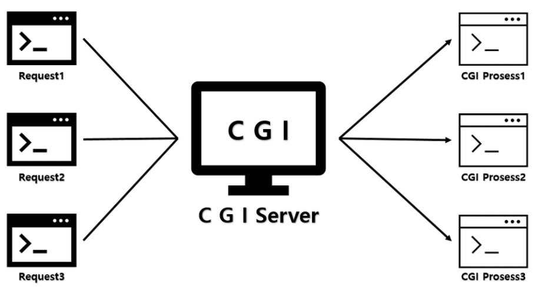
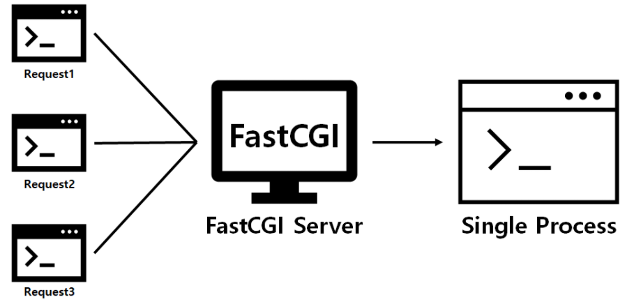
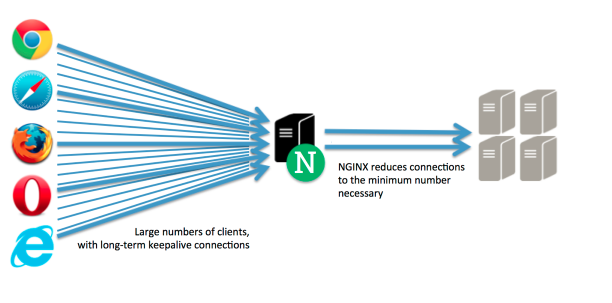
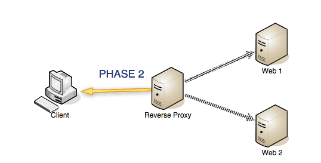
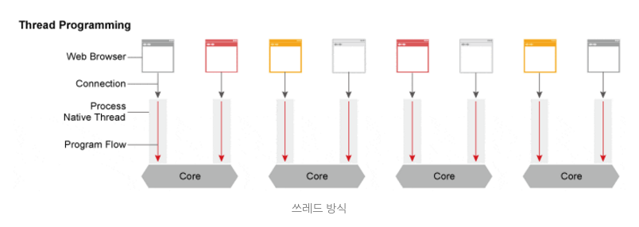
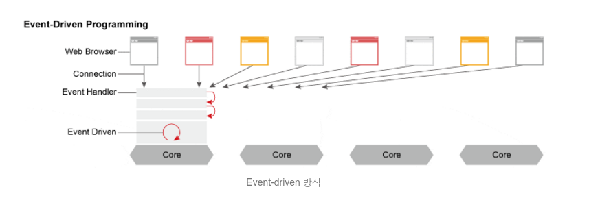

# PHP Playground

# 1. Window / Linux 환경 설정

## Window PHP 환경 설정

실행 방법
```
1. Wnmp 실행
2. Application 실행
```

**아파치와 php7는 라이브러리 충돌 및 오류 때문에 잘 쓰이지 않음**

1. WNMP 설치
2. {설치경로}/conf/nginx/nginx.conf - root directory 변경 

## Vitual Machine 환경 설정

환경 설정 방법

```
1. PHP-fpm 실행
2. nginx 실행
 - Nginx 실행 : service nginx start 
 - Nginx 중단 : service nginx stop 
 - Nginx 재시작 : service nginx restart  / nginx 서버 중단 후 재가동
 - Nginx 리로드 : service nginx reload  / 설정만 다시 적용
 - Nginx 자동 시작 : service nginx enable 
 - Nginx 상태 : service nginx status
```

**Tip!!**
 - 설정파일 이상 여부 검사 : nginx -t
 - error log확인 : tail -f /var/log/nginx/error.log 

1. 텍스트 모드 부팅 설정

```
sudo systemctl set-default multi-user.target
```

2. putty로 vitual box 연결  
[putty로 virtualbox 연결하기 - 숭숭이님 블로그](https://m.blog.naver.com/skddms/220575084716)  

3. vim 설정  
[[Vim]vim 설정하기 - heyhyo님 블로그](https://hyoje420.tistory.com/51)  

4. nginx 설치 및 환경설정

5. php 설치 및 환경설정  
[Ubuntu 18.04 / Nginx, PHP, MariaDB 설치하고 설정하기 - manualfactory](https://www.manualfactory.net/10903)

- 1) apt-get install nginx
- 2) apt-get install php-fpm
- 3) /etc/nginx/sites-available/default 파일 수정
```
# 1. index.php 자동 인식하게 설정
index index.html index.htm index.nginx-debian.html;

# 2. 설치한 php fpm에 맞게 수정
location ~ \.php$ {
  include snippets/fastcgi-php.conf;
  fastcgi_pass unix:/var/run/php/php7.2-fpm.sock
}
```


# 2. Nginx

## CGI(Common Gateway Interface) 란?
> 웹서버와 외부 프로그램(C, PHP, Python 등) 사이에서 정보를 주고받는 방법과 규약

**이 표준에 맞춰 만들어진 것이 CGI 스크립트이다.**



<!-- TODO : 항목들 정리 -->
관련 용어
 - Web Server : 
 - WAS : 

### 장점
 - 언어, 플랫폼에 독립적
 - 매우 단순하고 다른 서버 사이드 프로그래밍 언어에 비해 쉽게 수행
 - 라이브러리가 풍부하다
 - 가볍다

### 단점
 - 느리다(요청이 올 때 마다 DB connection을 새로 열어야 한다)
<!-- TODO : 확인해보자 -->
 - HTTP 요청마다 **새로운 프로세스를 만들어** 서버 메모리를 사용한다
 - 데이터가 메모리에 캐시될 수 없다.


## FastCGI란?
> 하나의 큰 프로세스로 동작한다. 이 프로세스가 계속해서 새로운 요청 처리(CGI 단점 해결)



대부분의 웹서버 **(Nginx, IIS, Apache)** 가 FastCGI를 제공한다.

### 장점


### 단점


## PHP-FPM(Fast Process Manager)
> PHP를 FastCGI 모드로 동작하게 해준다.


## 역할
1. 정적 파일을 처리하는 **HTTP 서버**로서의 역할



2. 응용 프로그램 서버에 요청을 보내는 **리버스 프록시** 역할



### 리버스 프록시란?
 > 클라이언트가 서버에 요청하면, 프록시 서버가 배후 서버(응용프로그램 서버)로부터 데이터를 가져옴

### 리버스 프록시를 쓰는 이유
 > **프록시 서버를 둠으로써 요청을 배분하는 역할**
 > cli가 직접 App 서버에 요청하면 프로세스 1개가 응답대기 상태가 되어서 요청에 대한 버퍼링이 생김

### Event-driven 방식

Thread 기반은 하나의 커넥션당 하나의 쓰레드를 사용

Event-driven 방식은 Event Handler를 통해 비동기 방식으로 처리해 먼저 처리되는 것부터 로직이 진행된다.






## Nginx 파일 구조

**설정 수정 시 원본을 복사해 보관해 두는 습관 가지자!**

### 설정 파일

두개의 파일을 보며 Nginx 설정에 대해 확인해보자
> /etc/nginx/nginx.conf
> /etc/nginx/sites-available/default

#### /etc/nginx/nginx.conf
```
user www-data;
worker_processes auto;
pid /run/nginx.pid;

events {
        worker_connections 768;
        # multi_accept on; #기본값:off
}

http {
        sendfile on;
        tcp_nopush on;
        tcp_nodelay on;
        keepalive_timeout 10; #기본값:75
        types_hash_max_size 2048;
        server_tokens off;

        server_names_hash_bucket_size 64; #기본값:32
        server_names_hash_max_size 2048; #기본값:512
        # server_name_in_redirect off;

        include /etc/nginx/mime.types;
        default_type application/octet-stream;

        access_log off; log_not_found off;
        error_log /var/log/nginx/error.log warn;

        include /etc/nginx/conf.d/*.conf;
        include /etc/nginx/sites-enabled/*;
}

```
nginx.conf 파일은 접속자 수, 동작 프로세스 수 등 퍼포먼스에 대한 기본적인 설정 항목

크게 3가지 항목으로 나뉜다.

1. 최상단 (Core 모듈)

user : Nginx 프로세스(워커 프로세스)가 실행되는 권한
 - nginx는 master process, worker process로 동작한다.
 - 실질적으로 **worker process가 실직적인 웹서버 역할** 수행
 - root로 설정되어 있을 경우, 워커 프로세스를 root 권한으로 동작
   -> 악의적인 사용자가 제어하게 된다면 보안상 위험
   -> 보통 **www-data, www, nginx**와 같이 계정이 하는 일에 대한 대표성 있는 이름 사용
   (default 값 - ubuntu : www-data, 기타 nobody )
   -> 이 계정들은 일반 유저의 권한으로 쉘에 접속 할 수 없어야 안전하다.

ubuntu 에서 계정 생성방법
```bash
$ useradd --shell /usr/sbin/nologin www-data
```

worker_processes : Nginx 프로세스 실행 가능 수
 - auto일 경우도 있지만, 명시적으로 서버의 코어 수 만큼 할당하는 것이 보통(더 높게도 가능)

pid : Nginx 마스터 프로세스 정보


2. events

worker_connections : 몇개의 접속을 동시에 처리할 것인가
 - worker_processes * worker_connections = **처리 할 수 있는 커넥션의 양**
 - Tip!!
   - 여러 자료와 퍼포먼스 테스트를 하며 값을 조정해야 한다.

3. http
 - keepalive_timeout : 
 - servers token : 
 - types_hash_max_size, server_names_hash_bucket_size : 


4. 기타
 - include 옵션 : 
 - ex) 리버스 프록시를 각 도메인에 설정한다고 했을 때 헤더 처리 옵션등을 conf.d에 넣어두고 불러온다. (nginx.conf 설정 파일이 깔끔해짐)
   - 리버스 프록시란? : 


/etc/nginx/sites-available/default
```
server {
    listen       80;
    server_name  localhost;
 
    root   /usr/share/nginx/html;
    location / {
        index  index.html index.htm index.php;
    }
 
    location = /50x.html {
        root   /usr/share/nginx/html;
    }

    location ~ \.php$ {
        fastcgi_pass   unix:/var/run/php5-fpm.sock;
        fastcgi_index  index.php;
        fastcgi_param  SCRIPT_FILENAME  $document_root$fastcgi_script_name;
        include        fastcgi_params;
    }
}
```


**설정 파일을 변경하면 nginx에 반영해야 하는데, reload 명령을 이용한다**

### 로그 파일 위치
> /var/log/nginx


# 3. codeigniter3

## CI 동작


1. index.php CI가 동작하기 위한 기반 리소스 초기화
2. Router 모듈 동작 결정
   2.1) 캐시 파일 존재 -> 캐시 파일 전송
3. Security 모듈이 Controller로 이동하기 전에 필터링
4. Controller 사용자 요청 처리
5. View 모듈 렌더링 -> 전송 (캐시 추가)


## CI URL

새그먼트 기반 URL 사용

```
example.com/news/article/my_article
{호스트 주소}/{호출될 Controller}/{클래스 안의 호출될 Function}/{변수}
```

<!-- TODO : nginx index.php 제거 방법 -->

## MVC

1. Model : 데이터구조 표현, 모델 클래스는 데이터 함수 포함
2. View : 사용자에게 보여질 화면
3. Controller : Model과 View사이 동작


<!-- TODO : 파일 구조 설명 -->

## Controller
> URL과 상호작용하는 클래스 파일

### 특징
 - 클래스 명은 항상 **대문자로 시작**

**Tip!!**
$this, self, -> 차이
<!-- TODO : 정리해야 한다. -->

[참고 블로그](https://m.blog.naver.com/PostView.nhn?blogId=vefe&logNo=221454883593&proxyReferer=https:%2F%2Fwww.google.com%2F)

## Route
> application/config/routes.php에 작성
<!-- TODO : 생활코딩 강의 -> ref문서 정리 -->

## View

## Model
> Model은 데이터를 가져오는 로직을 메소드로 정의, Controller를 통해 사용된다.

### 데이터 베이스 설정

> Application/config/database.php 파일을 수정

파일 속성
```
hostname : 데이터베이스 서버의 주소 (localhost는 PHP와 같은 머신을 의미)
username : 데이터베이스 사용자의 이름
password : 데이터베이스 비밀번호
database : 데이터베이스 명
dbdriver : 데이터베이스의 종류로 지원되는 드라이브의 목록은 system/database/drivers 디렉토리명을 참고한다.
```

### 데이터 베이스 라이브러리 로드
2가지 방법이 있다.

```
1. application/config/autoload.php 파일의 $autoload['libraries'] 배열에 'database'를 추가한다. 
2. controller 내에서 $this->load->database()를 호출한다.
```

### Model 파일 생성 규칙
 - **application/models/{모델 명_model}.php** 형식으로 생성
 - 파일은 **CI_Model 클래스 상속**
 - 클래스 명은 **대문자로 시작**

### Model load

1. Model load
 - 형식
```
$this->load->model('소문자로된 모델 클래스 명');
```
 - 예제
```
$this->load->model('topic_model');
```

2. Model call
 - 형식
```
모델 클래스 명 -> 메소드 명
```
 - 예제
```
$topics = $this -> topic_model -> gets();
```

### Model 내 쿼리 사용
> $this->db 이용!

- 사용 예제 
```
$query - $this->db->query('SELECT name, title, email FROM my_table');

foreach($query->result() as $row) {
   echo $row->title;
   echo $row->name;
   echo $row->email;
}

echo 'Total Results: ' . $query->num_rows();
```

#### 결과 불러오기
> **객체 배열 리턴**한다.

1. 다중 결과(객체)
   - result()
2. 다중 결과(배열)
   - result_array()
3. 단일 결과(객체)
   - row()
4. 단일 결과(배열)
   - row_array()

<!-- TODO : 표준 입력 예제, 쿼리 빌더 -->
<!-- http://www.ciboard.co.kr/user_guide/kr/database/examples.html#standard-insert -->

<!-- TODO : Active Record vs JPA 비교 -->

## Error 해결
 강의 예제 실행 중 오류
> localhost/index.php/topic 404에러

{nginx설치 경로}/conf/nginx.conf sever설정에 아래 코드 추가 

```
if (!-e $request_filename ) {
	rewrite ^(.*)$ /index.php last;
}
```

## Helper
> 자주 사용하는 로직을 재활용 할 수 있게 만드는 Library

1. 기본적인 로드 방법
```
$this->load->helper('헬퍼 이름')
```

2. 복수의 헬퍼를 로드하기 위한 방법
```
$this->load->helper(array('헬퍼1의 이름', '헬퍼2의 이름'));
```


# Reference
  
  
  
  
  
  
  
  
  
  
  
  
  