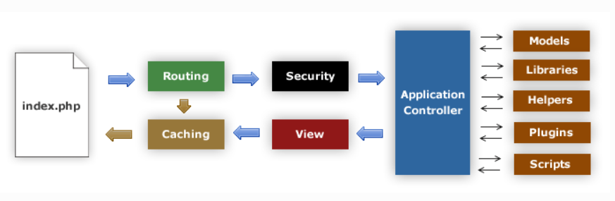
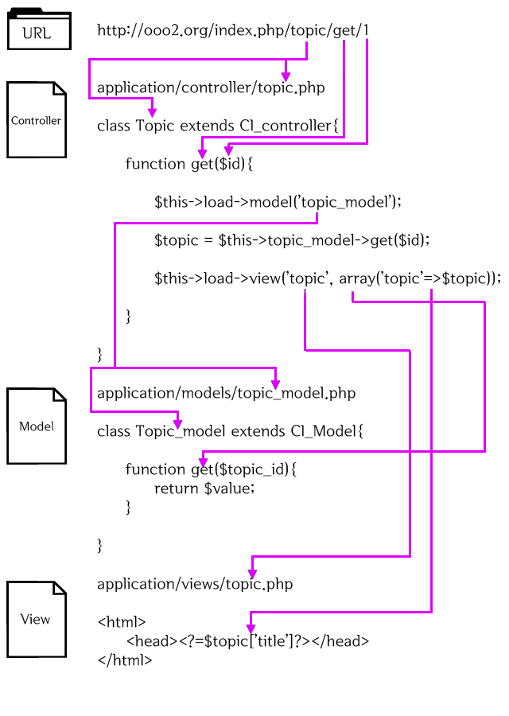

# PHP Playground

## 강의

[Codeigniter - 생활코딩](https://opentutorials.org/course/697/3829)  
[WEB2-PHP - 생활코딩](https://www.youtube.com/watch?v=Qh_6JheU_gY&list=PLuHgQVnccGMAMMNByX8Bf1BkVrShBhj1I)  
[PHP - 생활코딩](https://www.youtube.com/watch?v=dy9yQIx38u8&list=PLuHgQVnccGMDzq8zAwEY5lvwDWXWTZjB6)  
[WEB3-PHP&MySQL](https://www.youtube.com/watch?v=NChP-7KMQ_U&list=PLuHgQVnccGMA5836CvWfieEQy0T0ov6Jh)  

위 강의를 듣고 공부한 소스 및 내용 정리


# WEB2-PHP

## Window PHP 환경 설정

실행 방법
```
1. Wnmp 실행
2. Application 실행
```

**아파치와 php7는 라이브러리 충돌 및 오류 때문에 잘 쓰이지 않음**

1. WNMP 설치
2. {설치경로}/conf/nginx/nginx.conf - root directory 변경  
[참고 블로그](https://niceman.tistory.com/135)

## Vitual Machine 환경 설정

실행 방법
```
1. PHP-fpm 실행
2. nginx 실행
 - Nginx 실행 : systemctl start nginx
 - Nginx 중단 : systemctl stop nginx
 - Nginx 재시작 : systemctl restart nginx / nginx 서버 중단 후 재가동
 - Nginx 리로드 : systemctl reload nginx / 설정만 다시 적용
 - Nginx 자동 시작 : systemctl enable nginx
3. SQLite 실행
```
**Tip!!**
 - 설정파일 이상 여부 검사 : nginx -t
 - error log확인 : tail -f /var/log/nginx/error.log 

1. 텍스트 모드 부팅 설정

```
sudo systemctl set-default multi-user.target
```

2. putty로 vitual box 연결  
[참고 블로그](https://m.blog.naver.com/skddms/220575084716)  

3. vim 설정  
[참고 블로그](https://hyoje420.tistory.com/51)  

4. nginx 설치 및 환경설정

5. php 설치 및 환경설정  
[참고 블로그](https://www.manualfactory.net/10903)

# codeigniter3
[codeigniter 생활코딩 강의](https://opentutorials.org/course/697/3824)  

## CI 동작



1. index.php CI가 동작하기 위한 기반 리소스 초기화
2. Router 모듈 동작 결정
   2.1) 캐시 파일 존재 -> 캐시 파일 전송
3. Security 모듈이 Controller로 이동하기 전에 필터링
4. Controller 사용자 요청 처리
5. View 모듈 렌더링 -> 전송 (캐시 추가)


## CI URL

새그먼트 기반 URL 사용
```
example.com/news/article/my_article
{호스트 주소}/{호출될 Controller}/{클래스 안의 호출될 Function}/{변수}
```

<!-- TODO : nginx index.php 제거 방법 -->

## MVC

1. Model : 데이터구조 표현, 모델 클래스는 데이터 함수 포함
2. View : 사용자에게 보여질 화면
3. Controller : Model과 View사에 동작



## Controller
> URL과 상호작용하는 클래스 파일

### 특징
 - 클래스 명은 항상 **대문자로 시작**

**Tip!!**
$this, self, -> 차이
<!-- TODO : 정리해야 한다. -->

[참고 블로그](https://m.blog.naver.com/PostView.nhn?blogId=vefe&logNo=221454883593&proxyReferer=https:%2F%2Fwww.google.com%2F)

## Route
> application/config/routes.php에 작성
<!-- TODO : 생활코딩 강의 -> ref문서 정리 -->

## View

## Model
> Model은 데이터를 가져오는 로직을 메소드로 정의, Controller를 통해 사용된다.

### 데이터 베이스 설정

> Application/config/database.php 파일을 수정

파일 속성
```
hostname : 데이터베이스 서버의 주소 (localhost는 PHP와 같은 머신을 의미)
username : 데이터베이스 사용자의 이름
password : 데이터베이스 비밀번호
database : 데이터베이스 명
dbdriver : 데이터베이스의 종류로 지원되는 드라이브의 목록은 system/database/drivers 디렉토리명을 참고한다.
```

### 데이터 베이스 라이브러리 로드
2가지 방법이 있다.

```
1. application/config/autoload.php 파일의 $autoload['libraries'] 배열에 'database'를 추가한다. 
2. controller 내에서 $this->load->database()를 호출한다.
```

### Model 파일 생성 규칙
 - **application/models/{모델 명_model}.php** 형식으로 생성
 - 파일은 **CI_Model 클래스 상속**
 - 클래스 명은 **대문자로 시작**

### Model load

1. Model load
 - 형식
```
$this->load->model('소문자로된 모델 클래스 명');
```
 - 예제
```
$this->load->model('topic_model');
```

2. Model call
 - 형식
```
모델 클래스 명 -> 메소드 명
```
 - 예제
```
$topics = $this -> topic_model -> gets();
```

### Model 내 쿼리 사용
> $this->db 이용!

- 사용 예제 
```
$query - $this->db->query('SELECT name, title, email FROM my_table');

foreach($query->result() as $row) {
   echo $row->title;
   echo $row->name;
   echo $row->email;
}

echo 'Total Results: ' . $query->num_rows();
```

#### 결과 불러오기
> **객체 배열 리턴**한다.

1. 다중 결과(객체)
   - result()
2. 다중 결과(배열)
   - result_array()
3. 단일 결과(객체)
   - row()
4. 단일 결과(배열)
   - row_array()

<!-- TODO : 표준 입력 예제, 쿼리 빌더 -->
<!-- http://www.ciboard.co.kr/user_guide/kr/database/examples.html#standard-insert -->

<!-- TODO : Active Record vs JPA 비교 -->

## Error 해결
 강의 예제 실행 중 오류
> localhost/index.php/topic 404에러

{nginx설치 경로}/conf/nginx.conf sever설정에 아래 코드 추가 

```
if (!-e $request_filename ) {
	rewrite ^(.*)$ /index.php last;
}
```

# PHP 문법


# PHP 객체 지향 프로그래밍


# PHP + MySQL

